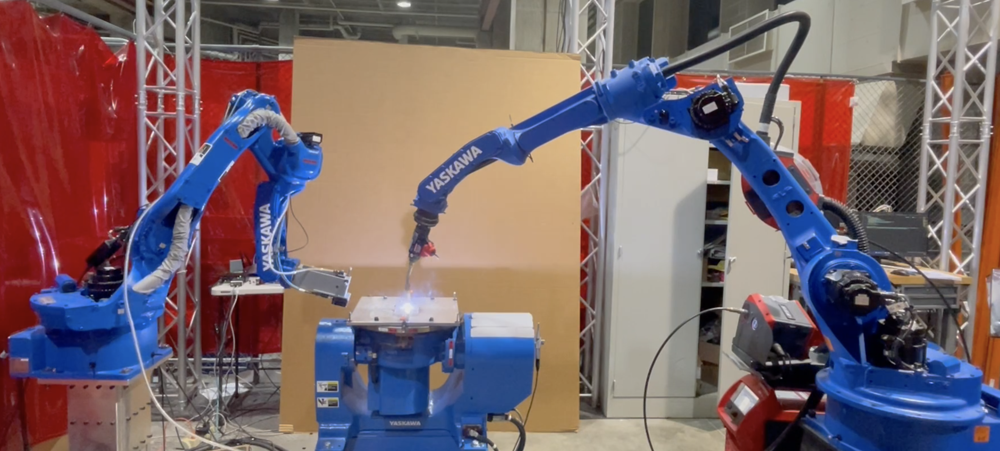
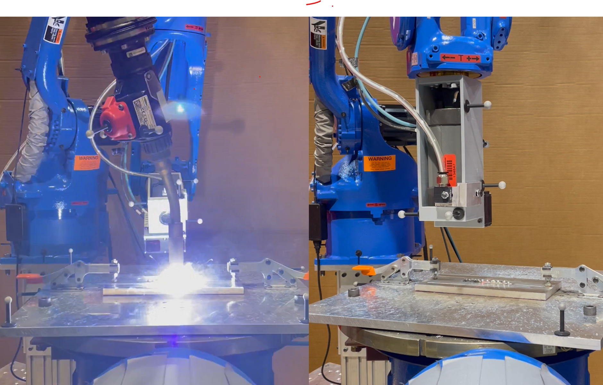

# Scan-n-Print

<p align="center">


</p>

We mounted MTI 2D laser scanner 

on the second robot to evaluate the WAAM layer height profile. 

We first conducted experiments of height deposition vs. torch velocity and feed-rate to estabilish a [model](). We then use the model during WAAM process along with MTI scanned height profile to achieve a flat deposition surface.

## Pre-request

* Data curves
* Robot definition files
* Welding and scanning joint space trajectory [here](https://github.com/rpiRobotics/Convergent_Manufacturing_WAAM/tree/main/redundancy_resolution)

## Hardware requirements

* Motoman robots
* Fronius welder
* MTI Scanner
* Flir thermal camera
* Microphone

## Execution

* Wall geometry scan-n-print
```
python weld_wall_scan.py
```

* Complex geometry scan-n-print
```
python weld_geometry_scan.py
```

* continuous scan-n-print
```
python streaming_scan_control.py
```

## Analyzation scripts

* Wall geometry scan-n-print
```
python read_weld_scan_data.py
```

* Complex geometry scan-n-print
```
python read_geoemtry_scan.py
```

* continuous scan-n-print
```
python read_streaming_online.py
```

## Datasets

Datasets can be found [here](https://rpi.box.com/s/c1w938dqypb7zt1a9em5qpaf17ukjf0s)

## Helper function

These codes/algorithms are used in the main execution codes. (Go to folder ```scan/``` for scanning codes.)

* ```weld_dh2v.py``` The code computes deposition height given the torch speed or vice versa for three metals used in the project.
* ```weldCorrectionStrategy.py``` The code includes scan-n-print correction strategies given the current scanned results and the target deposition height.
* ```WeldScan.py``` A compact function to execute a robot trajectory given the joint space trajectory and breakpoints.
* ```scanPathGen.py``` Given the weld curve, generate cartesian scanning path and the corresponding joint space trajecotries.
* ```scanProcess.py``` Given the scanned points and the corresponding robot joints, generates the 3D point clouds and deposition height.